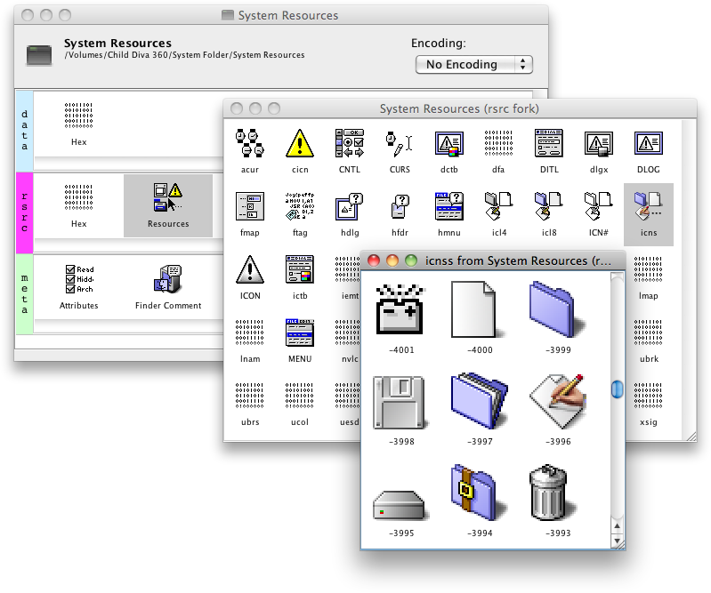
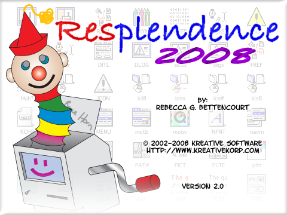

# Resplendence
Mac OS Classic and DFF resource editor

An earlier version of this application was somewhat popular and much more relevant years ago when Mac OS applications still used resource forks. This version is a rewrite I started back in 2008 and never finished.

To compile and run this application, you will also need to check out and compile the projects [KSFL](https://github.com/kreativekorp/ksfl), [PowerPaint](https://github.com/kreativekorp/powerpaint), and [OpenXION](https://github.com/kreativekorp/openxion).

